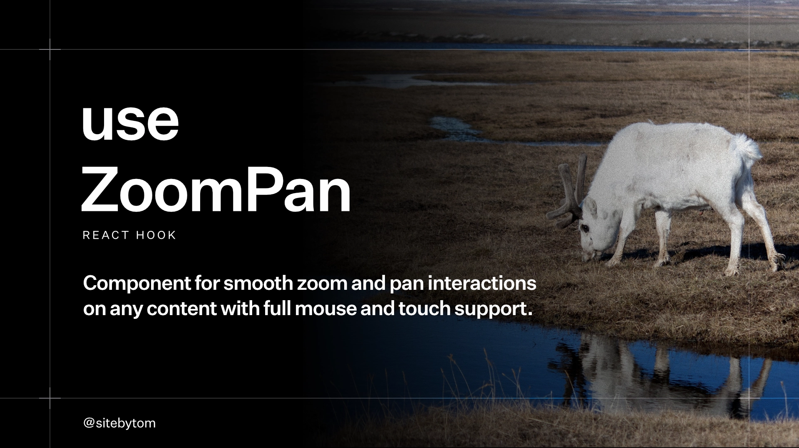

# useZoomPan

A **zero-dependency**, ultra-lightweight React hook and component for implementing smooth, high-performance zoom and pan interactions. Ideal for image viewers, galleries, maps, diagrams, and custom interactive canvases where you want full control without heavy dependencies.

[**Live Demo & Documentation**](https://sitebytom.github.io/use-zoom-pan/)

### Documentation
- [Quick Start](https://sitebytom.github.io/use-zoom-pan/#getting-started)
- [API Reference](https://sitebytom.github.io/use-zoom-pan/#api-reference)
- [Gestures & Controls](https://sitebytom.github.io/use-zoom-pan/#interactions)
- [Performance Optimization](https://sitebytom.github.io/use-zoom-pan/#performance)

### Interactive Examples
- [Simple Image Viewer](https://sitebytom.github.io/use-zoom-pan/#simple)
- [Hook & Live Playground](https://sitebytom.github.io/use-zoom-pan/#hook)
- [Gallery with Swipe Navigation](https://sitebytom.github.io/use-zoom-pan/#gallery)
- [Interactive Map Pins](https://sitebytom.github.io/use-zoom-pan/#pins)
- [SVG Blueprint Visualization](https://sitebytom.github.io/use-zoom-pan/#svg)
- [Rich HTML Content Zoom](https://sitebytom.github.io/use-zoom-pan/#content)

## Features

- **Ultra-Lightweight**: Zero dependencies, minimal bundle size.
- **High Performance**: Uses ref-based interaction tracking and minimal state updates to keep zoom and pan interactions smooth and responsive.
- **Mouse Controls**: Scroll to zoom at cursor, click to toggle zoom, drag to pan.
- **Touch Controls**: Pinch to zoom at center, double-tap to zoom/reset, swipe to navigate.
- **Keyboard Controls**: Zoom with `+`/`-`, pan with arrows, and instant reset with `Esc`.
- **Precision Focal Math**: Implemented with a top-left origin for rock-solid cursor tracking during zoom.
- **Smart Bounds**: Prevents over-panning with configurable buffer zones and symmetrical clamping.
- **Mobile First**: Optimized touch thresholds, double-tap gestures, and native-feeling interactions.
- **Content Agnostic**: Works with images, SVG, canvas, or any HTML content.

## Quick Start

### Installation

```bash
pnpm add @sitebytom/use-zoom-pan
```

### Component Approach
Wraps any content and handles the standard zoom/pan logic automatically.

```tsx
import { ZoomPan } from '@sitebytom/use-zoom-pan'

const MyViewer = () => (
  <div style={{ width: '100%', height: '500px' }}>
    <ZoomPan>
      
    </ZoomPan>
  </div>
)
```

### Hook Approach
For custom UI layouts where you need access to the raw `scale` and `position` state.

```tsx
import { useRef } from 'react'
import { useZoomPan } from '@sitebytom/use-zoom-pan'

const MyCustomViewer = () => {
  const containerRef = useRef<HTMLDivElement>(null)
  const { scale, position, contentProps, containerProps } = useZoomPan({ containerRef })

  return (
    <div 
      ref={containerRef} 
      {...containerProps}
      style={{ width: '100%', height: '500px', overflow: 'hidden' }}
    >
      
    </div>
  )
}
```

> **Controlled vs. Uncontrolled**: The hook manages zoom and pan state internally but exposes `scale` and `position` for read-only inspection or custom UI overlays.

### Automatic Event Management
Spread `containerProps` onto your container element if you want the hook to manage container-level pointer events (like scroll-to-zoom and dragging) automatically.

## API Reference

### Component Props (`<ZoomPan />`)

| Prop | Type | Default | Description |
|------|------|---------|-------------|
| `children` | `ReactNode` | Required | The content to make zoomable. |
| `enableZoom` | `boolean` | `true` | Enable/disable zoom functionality. |
| `onNext / onPrev` | `() => void` | - | Callbacks for swipe-based navigation. |
| `options` | `ZoomPanOptions` | - | Configuration overrides (see Options below). |
| `className` | `string` | - | Additional CSS class for the container. |

### Configuration Options

| Option | Type | Default | Description |
|--------|------|---------|-------------|
| `minScale` | `number` | `1` | Minimum zoom level. |
| `maxScale` | `number` | `6` | Maximum zoom level. |
| `zoomSensitivity` | `number` | `0.002` | Scaling multiplier for scroll wheel. |
| `clickZoomScale` | `number` | `2.5` | Snap-to scale on double click/tap. |
| `dragThresholdTouch` | `number` | `10` | Pixels to move before panning triggers (touch). |
| `dragThresholdMouse` | `number` | `5` | Pixels to move before panning triggers (mouse). |
| `swipeThreshold` | `number` | `50` | Pixels to move before swipe navigation triggers. |
| `boundsBuffer` | `number` | `80` | Extra panning room beyond content edges. |
| `initialScale` | `number` | - | Initial zoom level. |
| `initialPosition` | `Position` | - | Initial x/y coordinates. |
| `manageCursor` | `boolean` | `true` | Automatically handle zoom-in/grab cursor states. |
| `enableSwipe` | `boolean` | `true` | Enable/disable swipe gestures for navigation. |

### Hook Return Value

The `useZoomPan` hook returns an object containing the current state and necessary event handlers.

| Value | Type | Description |
|-------|------|-------------|
| `scale` | `number` | Current zoom level (1-4 by default). |
| `position` | `object` | Current pan coordinates `{ x, y }`. |
| `isDragging` | `boolean` | True when the user is actively panning. |
| `reset` | `function` | Resets zoom and pan to centered defaults. |
| `zoomTo` | `function` | Imperative zoom to `(x, y, scale)` in container coords. |
| `contentProps` | `object` | Event handlers to spread on the zoomable content. |
| `containerProps` | `object` | Event handlers to spread on the container element. |

## Interaction Guide

### Mouse Controls
- **Scroll Wheel**: Zoom in/out at cursor position.
- **Left Click**: Toggle zoom level (1x ⟷ 2.5x).
- **Drag**: Pan the content when zoomed in.

### Touch Controls
- **Pinch**: Smooth scale at the center of the pinch.
- **Double Tap**: Toggle zoom level.
- **Swipe**: Navigate between content (if `onNext`/`onPrev` provided).

### Keyboard Controls
- **`+` or `=`**: Zoom in at the center of the viewport.
- **`-` or `_`**: Zoom out from the center of the viewport.
- **Arrow Keys**: Pan the content in any direction while zoomed.
- **`Escape`**: Instantly reset zoom and position to default.

## Performance Tuning

The hook is designed to be **highly optimized** for smooth interactions on high-resolution displays and mobile devices. To maintain responsiveness without taxing the main thread, follow these best practices:

- **will-change**: Apply `will-change: transform` to your content element to promote it to its own GPU layer.
- **Avoid Transitions**: Do not use CSS transitions for the transform property while the user is actively dragging; the hook handles position updates via JS for maximum responsiveness.
- **Touch Action**: Add `touch-action: none` to your viewport to prevent browser-native scrolling while interacting with the component.
- **Optimized state updates**: `useZoomPan` minimizes React work during interactions by tracking gesture state in refs and only committing state when visual output changes.

---

### Design Philosophy

The hook avoids continuous `requestAnimationFrame` loops and animation libraries, relying instead on native pointer events and direct transform updates for a predictable, lightweight, and low-latency experience.